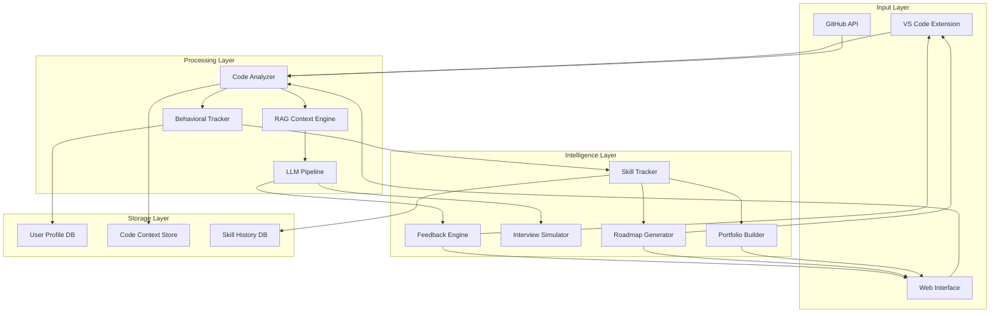

# Design Document: ForgeFlow

## Overview

ForgeFlow is an AI-powered developer mentorship system that accelerates job readiness through continuous feedback, code review, and interview coaching. The system architecture follows a modular pipeline design where code inputs flow through analysis, feedback generation, skill tracking, and output generation stages.

The core technical approach combines:
- **Static code analysis** using AST parsing and pattern matching
- **LLM-based evaluation** for code quality, interview responses, and learning recommendations
- **RAG (Retrieval-Augmented Generation)** over repository context for contextual feedback
- **Behavioral analytics** tracking user patterns and skill progression
- **Adaptive learning algorithms** that personalize roadmaps based on skill gaps

The MVP focuses on Python and JavaScript support, GitHub integration, and a VS Code extension with optional web interface. The system prioritizes near real-time feedback (< 2s) and user privacy with optional local inference.

## Architecture

### High-Level System Architecture



### Component Interaction Flow

1. **Code Input → Analysis**: User submits code via VS Code extension or web interface; Code Analyzer parses AST and extracts structure
2. **Analysis → Context Building**: RAG Context Engine builds semantic embeddings of codebase for contextual understanding
3. **Context → LLM Processing**: LLM Pipeline receives code structure + context + user history for evaluation
4. **LLM → Feedback Generation**: Feedback Engine produces specific, actionable code review comments
5. **Behavioral Tracking**: Behavioral Tracker monitors editing patterns, errors, and refactoring attempts in parallel
6. **Skill Assessment**: Skill Tracker aggregates behavioral signals + code quality + interview performance into readiness scores
7. **Adaptive Planning**: Roadmap Generator uses skill gaps to create personalized learning plans
8. **Portfolio Compilation**: Portfolio Builder aggregates verified achievements into recruiter-friendly format

## Components and Interfaces

### 1. Code Analyzer

**Responsibility**: Parse source code, extract structure, identify patterns, and detect quality issues.

**Interface**:
```python
class CodeAnalyzer:
    def parse_file(self, file_path: str, language: str) -> CodeAST:
        """Parse source file into abstract syntax tree"""
        
    def analyze_structure(self, ast: CodeAST) -> StructureReport:
        """Analyze code organization, complexity, and patterns"""
        
    def detect_issues(self, ast: CodeAST) -> List[CodeIssue]:
        """Identify readability, structure, and scalability concerns"""
        
    def extract_context(self, repo_path: str) -> RepoContext:
        """Build repository-level context including dependencies and architecture"""
```

**Implementation Notes**:
- Use language-specific parsers (Python: `ast` module, JavaScript: `@babel/parser`)
- Implement complexity metrics (cyclomatic complexity, nesting depth)
- Pattern detection for common anti-patterns and code smells
- Repository graph construction for dependency analysis

### 2. Feedback Engine

**Responsibility**: Generate actionable, contextual code review feedback with specific improvement suggestions.

**Interface**:
```python
class FeedbackEngine:
    def generate_feedback(self, 
                         code_issues: List[CodeIssue],
                         repo_context: RepoContext,
                         user_profile: UserProfile) -> List[FeedbackItem]:
        """Generate prioritized feedback items with explanations and examples"""
        
    def format_for_display(self, feedback: List[FeedbackItem], 
                          platform: str) -> DisplayFormat:
        """Format feedback for VS Code inline comments or web dashboard"""
        
    def adapt_tone(self, feedback: FeedbackItem, 
                   user_level: str) -> FeedbackItem:
        """Adjust feedback complexity and tone based on user experience level"""
```

**Implementation Notes**:
- LLM prompt engineering for constructive, specific feedback
- Template system for common feedback patterns
- Severity classification (critical, important, suggestion)
- Code example generation for recommended improvements

### 3. Behavioral Tracker

**Responsibility**: Monitor user coding patterns, detect repeated mistakes, and identify learning signals.

**Interface**:
```python
class BehavioralTracker:
    def track_edit_session(self, session: EditSession) -> BehavioralSignals:
        """Record editing patterns, hesitation zones, and revision frequency"""
        
    def identify_error_patterns(self, errors: List[Error]) -> List[ErrorPattern]:
        """Detect repeated mistakes and categorize by concept"""
        
    def analyze_refactoring(self, before: CodeAST, after: CodeAST) -> RefactorQuality:
        """Evaluate refactoring approach and outcome"""
        
    def get_user_trends(self, user_id: str, timeframe: str) -> TrendAnalysis:
        """Analyze behavioral trends over time"""
```

**Implementation Notes**:
- Event-based tracking with timestamps
- Pattern matching algorithms for error categorization
- Diff analysis for refactoring quality assessment
- Time-series analysis for trend detection

### 4. Interview Simulator

**Responsibility**: Generate realistic interview questions, evaluate responses, and provide coaching feedback.

**Interface**:
```python
class InterviewSimulator:
    def generate_question(self, 
                         user_code: CodeAST,
                         career_goal: CareerGoal,
                         difficulty: str) -> InterviewQuestion:
        """Create code-based interview question from user's work"""
        
    def evaluate_response(self, 
                         question: InterviewQuestion,
                         user_response: str) -> ResponseEvaluation:
        """Assess technical accuracy, reasoning quality, and communication clarity"""
        
    def generate_followup(self, 
                         question: InterviewQuestion,
                         response: str) -> FollowupQuestion:
        """Create contextually relevant follow-up question"""
        
    def simulate_system_design(self, career_goal: CareerGoal) -> SystemDesignChallenge:
        """Generate architecture challenge appropriate to target role"""
```

**Implementation Notes**:
- Question bank seeded from user's actual code
- LLM-based response evaluation with rubric
- Difficulty progression based on performance
- System design templates for different roles

### 5. Skill Tracker

**Responsibility**: Calculate readiness scores, identify skill gaps, and track progress over time.

**Interface**:
```python
class SkillTracker:
    def calculate_readiness_score(self, user_id: str) -> JobReadinessScore:
        """Compute composite readiness score from multiple dimensions"""
        
    def identify_strengths(self, user_history: UserHistory) -> List[Strength]:
        """Identify specific strengths with supporting evidence"""
        
    def identify_gaps(self, user_history: UserHistory, 
                     career_goal: CareerGoal) -> List[SkillGap]:
        """Detect skill gaps relative to target role requirements"""
        
    def track_progress(self, user_id: str, metric: str) -> ProgressTimeline:
        """Monitor improvement in specific metrics over time"""
```

**Implementation Notes**:
- Multi-dimensional scoring algorithm
- Weighted aggregation based on career goal
- Percentile ranking against role benchmarks
- Progress visualization data generation

### 6. Roadmap Generator

**Responsibility**: Create personalized 6-week learning plans with adaptive milestones.

**Interface**:
```python
class RoadmapGenerator:
    def generate_roadmap(self, 
                        skill_gaps: List[SkillGap],
                        career_goal: CareerGoal,
                        time_budget: int) -> LearningRoadmap:
        """Create 6-week plan with weekly milestones and daily tasks"""
        
    def adapt_roadmap(self, 
                     roadmap: LearningRoadmap,
                     progress: ProgressUpdate) -> LearningRoadmap:
        """Adjust plan based on user progress and changing skill levels"""
        
    def recommend_projects(self, skill_gaps: List[SkillGap]) -> List[ProjectIdea]:
        """Suggest portfolio-building projects targeting specific gaps"""
        
    def generate_drills(self, skill_gap: SkillGap) -> List[PracticeDrill]:
        """Create targeted exercises for specific weaknesses"""
```

**Implementation Notes**:
- Task dependency graph for logical sequencing
- Difficulty calibration based on current skill level
- Project templates aligned with career goals
- Adaptive scheduling algorithm

### 7. Portfolio Builder

**Responsibility**: Compile annotated projects and verified skills into recruiter-friendly portfolio.

**Interface**:
```python
class PortfolioBuilder:
    def compile_portfolio(self, user_id: str) -> Portfolio:
        """Generate complete portfolio with projects and skill artifacts"""
        
    def annotate_project(self, project: Project) -> AnnotatedProject:
        """Add technical highlights and engineering decision explanations"""
        
    def create_decision_timeline(self, project: Project) -> DecisionTimeline:
        """Document key architectural choices and rationales"""
        
    def verify_skills(self, user_history: UserHistory) -> List[VerifiedSkill]:
        """Extract skill evidence from actual code and project work"""
        
    def format_for_recruiters(self, portfolio: Portfolio) -> RecruitableFormat:
        """Format with clear sections and visual hierarchy"""
```

**Implementation Notes**:
- Markdown/HTML template system
- Automated annotation using LLM
- Evidence linking (code → skill claim)
- Export formats (PDF, web page, GitHub README)

### 8. RAG Context Engine

**Responsibility**: Build and maintain semantic understanding of user's codebase for contextual feedback.

**Interface**:
```python
class RAGContextEngine:
    def build_embeddings(self, repo_context: RepoContext) -> EmbeddingStore:
        """Create semantic embeddings of codebase"""
        
    def retrieve_context(self, query: str, top_k: int) -> List[CodeContext]:
        """Retrieve relevant code context for given query"""
        
    def update_context(self, changes: List[CodeChange]) -> None:
        """Incrementally update embeddings based on code changes"""
```

**Implementation Notes**:
- Vector database for embedding storage (e.g., ChromaDB, Pinecone)
- Chunking strategy for large files
- Incremental updates for performance
- Hybrid search (semantic + keyword)

## Data Models

### CodeAST
```python
@dataclass
class CodeAST:
    language: str
    file_path: str
    functions: List[FunctionNode]
    classes: List[ClassNode]
    imports: List[ImportNode]
    complexity_score: float
    lines_of_code: int
```

### CodeIssue
```python
@dataclass
class CodeIssue:
    issue_type: str  # readability, structure, scalability, interview_quality
    severity: str  # critical, important, suggestion
    location: CodeLocation
    description: str
    suggested_fix: Optional[str]
    code_example: Optional[str]
```

### FeedbackItem
```python
@dataclass
class FeedbackItem:
    issue: CodeIssue
    explanation: str
    improvement_suggestion: str
    code_example: str
    priority: int
    learning_resources: List[str]
```

### BehavioralSignals
```python
@dataclass
class BehavioralSignals:
    edit_frequency: Dict[str, int]
    hesitation_zones: List[CodeLocation]
    error_patterns: List[ErrorPattern]
    refactor_attempts: List[RefactorAttempt]
    session_duration: int
    timestamp: datetime
```

### ErrorPattern
```python
@dataclass
class ErrorPattern:
    error_type: str
    frequency: int
    related_concept: str
    first_occurrence: datetime
    last_occurrence: datetime
    resolution_time_avg: float
```

### JobReadinessScore
```python
@dataclass
class JobReadinessScore:
    overall_score: float  # 0-100
    hiring_confidence: float
    debugging_maturity: float
    architecture_thinking: float
    communication_clarity: float
    last_updated: datetime
    trend: str  # improving, stable, declining
```

### InterviewQuestion
```python
@dataclass
class InterviewQuestion:
    question_text: str
    question_type: str  # code_explanation, debugging, system_design
    difficulty: str  # junior, mid, senior
    source_code: Optional[CodeAST]
    expected_topics: List[str]
    evaluation_rubric: Dict[str, str]
```

### LearningRoadmap
```python
@dataclass
class LearningRoadmap:
    user_id: str
    career_goal: CareerGoal
    start_date: datetime
    weeks: List[WeeklyPlan]
    milestones: List[Milestone]
    adaptive_adjustments: List[Adjustment]
```

### WeeklyPlan
```python
@dataclass
class WeeklyPlan:
    week_number: int
    focus_areas: List[str]
    daily_tasks: List[Task]
    projects: List[ProjectIdea]
    drills: List[PracticeDrill]
    expected_outcome: str
```

### Portfolio
```python
@dataclass
class Portfolio:
    user_id: str
    projects: List[AnnotatedProject]
    decision_timeline: DecisionTimeline
    verified_skills: List[VerifiedSkill]
    career_goal: CareerGoal
    generated_date: datetime
```

### UserProfile
```python
@dataclass
class UserProfile:
    user_id: str
    career_goal: CareerGoal
    experience_level: str  # beginner, intermediate, advanced
    preferred_languages: List[str]
    github_username: Optional[str]
    skill_history: List[SkillSnapshot]
    behavioral_history: List[BehavioralSignals]
    privacy_settings: PrivacySettings
```


## Correctness Properties

*A property is a characteristic or behavior that should hold true across all valid executions of a system—essentially, a formal statement about what the system should do. Properties serve as the bridge between human-readable specifications and machine-verifiable correctness guarantees.*

### Property 1: Code Parsing Round-Trip Consistency

*For any* valid source file in a supported language (Python or JavaScript), parsing the file into an AST and then reconstructing the code structure should preserve all semantic elements (functions, classes, imports, complexity metrics).

**Validates: Requirements 1.1, 1.3, 1.4**

### Property 2: Feedback Completeness

*For any* detected code issue (readability, structure, scalability, or interview-quality), the generated feedback should include all required components: description, specific improvement suggestion, code example, and severity classification.

**Validates: Requirements 2.2, 2.3, 2.4**

### Property 3: Behavioral Signal Capture Completeness

*For any* edit session, the recorded behavioral signals should include all specified fields: editing patterns, hesitation zones, revision frequency, error patterns, refactor attempts, session duration, and timestamp.

**Validates: Requirements 3.1**

### Property 4: Error Pattern Detection

*For any* sequence of errors where the same error type occurs more than twice within a session, the Skill Tracker should identify it as an error pattern and associate it with a related concept.

**Validates: Requirements 3.2**

### Property 5: Refactoring Tracking Completeness

*For any* code change where the before and after ASTs differ in structure but preserve functionality, the system should record it as a refactoring attempt with approach and outcome quality metrics.

**Validates: Requirements 3.3**

### Property 6: Behavioral Signal Persistence

*For any* recorded behavioral signal, retrieving the user's behavioral history should include that signal with all its original data intact.

**Validates: Requirements 3.4**

### Property 7: Feedback Adaptation Based on Behavior

*For any* user with recorded behavioral signals indicating repeated mistakes in a specific concept, feedback related to that concept should be more detailed than feedback for concepts without error patterns.

**Validates: Requirements 3.5**

### Property 8: Interview Question Relevance

*For any* generated interview question, the question should reference at least one concept, pattern, or technology present in the user's recent code submissions.

**Validates: Requirements 4.1**

### Property 9: Interview Response Evaluation Completeness

*For any* user response to an interview question, the evaluation should include both a reasoning quality score and a technical accuracy score.

**Validates: Requirements 4.2**

### Property 10: Follow-up Question Contextual Relevance

*For any* initial interview question and user response, generated follow-up questions should reference concepts mentioned in either the original question or the user's response.

**Validates: Requirements 4.3**

### Property 11: System Design Question Inclusion

*For any* user with a career goal that includes system design or architecture roles, the interview question set should include at least one architecture challenge.

**Validates: Requirements 4.4**

### Property 12: Interview Feedback Dual-Dimension Coverage

*For any* evaluated interview response, the feedback should address both communication clarity and technical depth as separate dimensions.

**Validates: Requirements 4.5**

### Property 13: Strength Identification with Evidence

*For any* identified strength in the skill diagnosis, there should be at least one piece of supporting evidence from the user's code or project history.

**Validates: Requirements 5.1**

### Property 14: Error Pattern Categorization

*For any* detected error pattern, it should be categorized with an associated underlying concept or skill gap identifier.

**Validates: Requirements 5.2**

### Property 15: Gap-to-Resource Mapping

*For any* identified conceptual gap in the skill diagnosis, the system should provide at least one targeted learning resource.

**Validates: Requirements 5.3**

### Property 16: Diagnosis Update After Sessions

*For any* significant coding session (duration > 30 minutes or > 50 lines changed), the skill diagnosis timestamp should be updated to reflect the new session data.

**Validates: Requirements 5.4**

### Property 17: Job Readiness Score Composition

*For any* user, the overall Job Readiness Score should be a deterministic function of the four component scores (hiring confidence, debugging maturity, architecture thinking, communication clarity), and all five scores should be present.

**Validates: Requirements 6.1, 6.2, 6.3, 6.4, 6.5**

### Property 18: Significant Score Change Notification

*For any* Job Readiness Score change exceeding 10 points, a notification should be generated with an explanation of which component scores changed.

**Validates: Requirements 6.6**

### Property 19: Roadmap Completeness and Structure

*For any* generated learning roadmap, it should include: 6 weekly plans, role-specific content aligned with the career goal, targeted drills for each identified skill gap, and measurable outcomes for each week.

**Validates: Requirements 7.1, 7.2, 7.3, 7.5**

### Property 20: Roadmap Adaptation on Progress

*For any* roadmap where user progress data changes (tasks completed or skill scores updated), the adapted roadmap should differ from the original in at least one task or milestone.

**Validates: Requirements 7.4**

### Property 21: Roadmap Update on Task Completion

*For any* completed roadmap task, the system should update the plan to mark the task complete and generate at least one next step suggestion.

**Validates: Requirements 7.6**

### Property 22: Portfolio Content Completeness

*For any* generated portfolio, it should include all required sections: annotated projects with technical highlights, engineering decision timeline, and verified skill artifacts with code evidence.

**Validates: Requirements 8.1, 8.2, 8.3**

### Property 23: Portfolio Career Goal Alignment

*For any* portfolio generated with a specified career goal, the emphasized skills and projects should have relevance scores higher for the target role than for unrelated roles.

**Validates: Requirements 8.5**

### Property 24: Local Inference Mode Privacy

*For any* analysis performed with local inference mode enabled, the system should not make any external network calls to LLM APIs or cloud services.

**Validates: Requirements 10.2**

### Property 25: Third-Party Sharing Consent Enforcement

*For any* operation that would send user code to a third-party service, the operation should only proceed if the user's consent flag for that service is explicitly set to true.

**Validates: Requirements 10.4**

### Property 26: Metrics Persistence Over Time

*For any* tracked metric (debugging time, code review score, interview readiness), recording a new data point should preserve all previous data points in the time series.

**Validates: Requirements 11.1, 11.2, 11.3**

### Property 27: Milestone Notification Triggering

*For any* progress milestone defined in the roadmap, when the user's metrics meet the milestone criteria, a notification should be generated with encouragement and next steps.

**Validates: Requirements 11.5**

## Error Handling

### Code Analysis Errors

**Parsing Failures**:
- When source code contains syntax errors, return a structured error with line number and error description
- When file encoding is unsupported, attempt UTF-8 fallback and notify user if conversion fails
- When file size exceeds limits, truncate and process partial content with warning

**Repository Access Errors**:
- When GitHub API rate limit is exceeded, queue requests and notify user of delay
- When OAuth token is invalid or expired, prompt user to re-authenticate
- When repository permissions are insufficient, request minimal additional permissions

### LLM Pipeline Errors

**API Failures**:
- When LLM API is unavailable, fall back to template-based feedback for common patterns
- When API response is malformed, retry with simplified prompt
- When token limits are exceeded, chunk input and aggregate results

**Context Building Errors**:
- When embedding generation fails, fall back to keyword-based context retrieval
- When vector database is unavailable, use in-memory cache for session

### User Input Errors

**Invalid Career Goals**:
- When career goal is unrecognized, suggest closest matching role from predefined list
- When career goal is too vague, prompt user with clarifying questions

**Incomplete Data**:
- When user history is insufficient for scoring, provide provisional scores with confidence intervals
- When behavioral signals are missing, use population averages as baseline

### Data Persistence Errors

**Database Failures**:
- When write operations fail, retry with exponential backoff
- When database is unavailable, cache operations locally and sync when available
- When data corruption is detected, restore from last known good state

**Consistency Errors**:
- When skill scores are inconsistent with underlying data, recalculate from source
- When timestamps are out of order, sort and deduplicate before processing

## Testing Strategy

### Dual Testing Approach

ForgeFlow requires both unit testing and property-based testing for comprehensive coverage:

**Unit Tests** focus on:
- Specific examples of code patterns and their expected feedback
- Edge cases like empty files, single-line files, or files with only comments
- Error conditions such as malformed API responses or invalid user inputs
- Integration points between components (e.g., Code Analyzer → Feedback Engine)
- Platform-specific functionality (VS Code extension, web interface)

**Property-Based Tests** focus on:
- Universal properties that hold across all valid inputs
- Comprehensive input coverage through randomization
- Invariants that should never be violated regardless of user behavior
- Round-trip consistency for parsing and serialization
- Behavioral properties that should hold across all user sessions

### Property-Based Testing Configuration

**Framework Selection**:
- **Python**: Use `hypothesis` library for property-based testing
- **JavaScript/TypeScript**: Use `fast-check` library for property-based testing

**Test Configuration**:
- Minimum 100 iterations per property test (due to randomization)
- Each property test must reference its design document property
- Tag format: `# Feature: forgeflow, Property {number}: {property_text}`

**Example Property Test Structure** (Python):
```python
from hypothesis import given, strategies as st

@given(st.text(min_size=1))
def test_code_parsing_round_trip(source_code):
    """
    Feature: forgeflow, Property 1: Code Parsing Round-Trip Consistency
    For any valid source file, parsing and reconstruction should preserve semantics
    """
    ast = code_analyzer.parse_file(source_code, "python")
    reconstructed = code_analyzer.reconstruct(ast)
    assert semantically_equivalent(source_code, reconstructed)
```

### Test Coverage Requirements

**Component-Level Testing**:
- Code Analyzer: 90%+ coverage on parsing logic
- Feedback Engine: 85%+ coverage on feedback generation
- Skill Tracker: 90%+ coverage on scoring algorithms
- Interview Simulator: 80%+ coverage on question generation
- Roadmap Generator: 85%+ coverage on plan creation
- Portfolio Builder: 80%+ coverage on compilation logic

**Integration Testing**:
- End-to-end flow: code submission → feedback display
- GitHub integration: OAuth flow → repository access → commit analysis
- VS Code extension: activation → inline feedback → user interaction
- Web interface: authentication → dashboard → portfolio export

**Performance Testing**:
- Feedback generation latency: < 2 seconds for files up to 1000 lines
- Repository parsing: < 30 seconds for repositories up to 5000 files
- Embedding generation: < 5 seconds for code chunks up to 500 lines
- Dashboard load time: < 1 second for user profiles with up to 100 sessions

### Mocking and Test Data

**External Dependencies**:
- Mock GitHub API responses for consistent testing
- Mock LLM API with deterministic responses for unit tests
- Use local embedding models for test environments

**Test Data Generation**:
- Generate synthetic code samples covering common patterns
- Create user profiles with varying experience levels
- Build test repositories with known characteristics
- Generate behavioral signal sequences for different user types

### Continuous Testing

**Pre-commit Hooks**:
- Run unit tests on changed files
- Run linting and type checking
- Verify property test examples pass

**CI/CD Pipeline**:
- Run full unit test suite on every commit
- Run property-based tests with 100 iterations
- Run integration tests on staging environment
- Generate coverage reports and fail if below thresholds

**Regression Testing**:
- Maintain test suite for previously fixed bugs
- Run regression tests before each release
- Track test execution time and optimize slow tests
